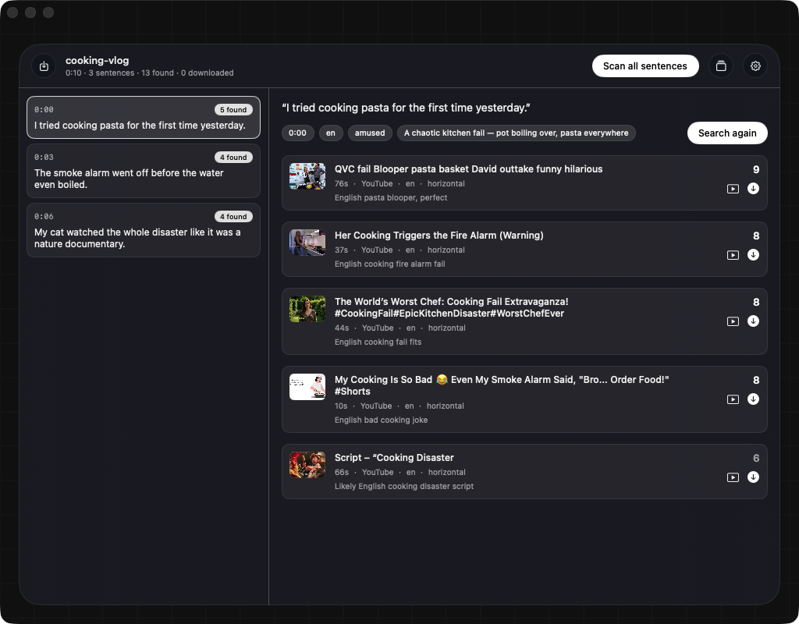

<p align="center"></p>

# Cutaway

**Cutaway finds the clips editors cut away to.**

Give it the video you're editing. It transcribes the speech, reads every sentence, and hunts down short viral or reaction clips that land right after that sentence. You pick the ones you like, Cutaway downloads them with timestamp names, and they drop straight into your Premiere, Final Cut, or Resolve bin.

A cutaway is the clip you briefly cut to before returning to your scene. This app finds yours.

## How it works

1. **Open a video.** Cutaway transcribes it locally with Whisper and splits the speech into sentences.
2. **Scan.** For each sentence, Claude extracts the intent (emotion, expected reaction, search queries) and Cutaway searches YouTube.
3. **Filter.** Candidates keep the source video's orientation (a vertical video gets vertical candidates) and obey the language rule: a clip with speech must speak the video's language, while a speechless clip only has to fit the topic.
4. **Score.** Claude rates each candidate 0-10 against the sentence. At least five make the list, each with a short reason, ordered by view count from most watched to least. Each suggestion also carries a cut window (`cut 0:04-0:07`), the seconds of the clip most likely to land after your sentence.
5. **Preview.** Click play and the candidate opens in a player inside the app, starting right at the suggested cut. No browser round-trip.
6. **Download.** One click. The clip lands in a `<video>-clips` folder next to your video, named like `00m12s-surprised-guy.mp4`, the timestamp of the sentence it belongs to.

Every download also joins a local library. Future scans match against the library first, so your proven clips resurface without another download.

## Requirements

- macOS 14 or newer
- Command line tools:

```bash
brew install openai-whisper ffmpeg
```

- An Anthropic credential (see below)

yt-dlp is not needed up front: Cutaway fetches the official build on first use and keeps it updated weekly (a brew copy wins when you have one). The app checks for the remaining tools on launch and shows the install commands. The first transcription downloads the Whisper model (about 1.5 GB), so it takes a while; every run after that is fast.

Don't want to install whisper? Add a Groq key (below) and transcription runs in the cloud instead.

## Install

Grab the zip from [Releases](../../releases), unzip, drag to Applications. The build is unsigned, so macOS will refuse to open it at first. Clear the quarantine flag:

```bash
xattr -dr com.apple.quarantine /Applications/Cutaway.app
```

or try to open it once, then approve it under System Settings → Privacy & Security → Open Anyway.

Or build from source:

```bash
brew install xcodegen
xcodegen generate
xcodebuild -project Cutaway.xcodeproj -scheme Cutaway -configuration Release build
```

## Credentials

Open Settings (gear icon) and paste one of:

- **Anthropic API key** (`sk-ant-api…`) from [console.anthropic.com](https://console.anthropic.com). Pay per use.
- **Claude subscription setup token** (`sk-ant-oat…`). If you have a Claude Pro or Max subscription, run `claude setup-token` in a terminal and paste the result. Usage then counts against your subscription; whether that fits Anthropic's terms for your account is yours to check.

An `ANTHROPIC_API_KEY` environment variable works too. Credentials live in the macOS Keychain and are never written to disk in the project.

Scans call `claude-sonnet-5`, two requests per sentence. To use a different model, for example the stronger Opus:

```bash
defaults write com.kasparov.cutaway cutaway.model claude-opus-5
```

For a fleet of machines you can embed a token pool into the build with `scripts/embed-tokens.py`, then re-run `xcodegen generate`; Cutaway rotates to the next token when one hits its rate limit. `Secrets.plist` is gitignored, so tokens never enter the repo.

## Cloud transcription with Groq (optional)

Cutaway's main transcription runs Whisper's large model locally. Wherever a smaller model would run instead — the quick speech check on downloaded clips, or a Mac with no whisper installed at all — a Groq key upgrades that step to `whisper-large-v3-turbo` in Groq's cloud, so every transcription stays at large quality.

1. Sign in at [console.groq.com](https://console.groq.com).
2. Open the **API Keys** page ([console.groq.com/keys](https://console.groq.com/keys)) and click **Create API Key**.
3. Copy the `gsk_…` key and paste it into Cutaway's Settings under **Groq API key**, then Save.

A `GROQ_API_KEY` environment variable works too. The free tier accepts audio up to 25 MB per request; Cutaway uploads a compressed mono audio track (not the video), so a typical several-minute video fits comfortably.

## Notes

- Downloads run through yt-dlp on your machine. Respect the rights of clip owners and the terms of the platforms you download from; what ends up in a published edit is your responsibility.
- The video itself never leaves your Mac. Only the sentence being scanned and the candidate titles are sent to the Anthropic API. If you add a Groq key, the audio track is uploaded to Groq for transcription; without one, audio stays local too.

Türkçe okumak için: [README.tr.md](README.tr.md)

## License

[MIT](LICENSE)
